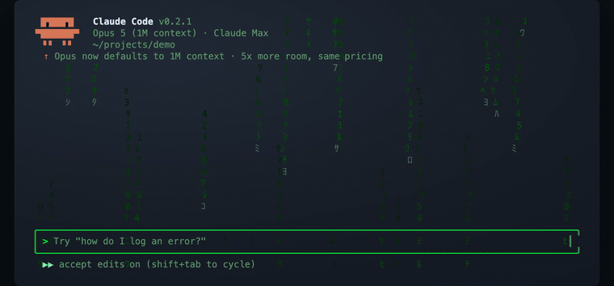
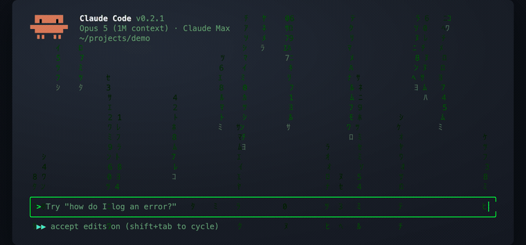
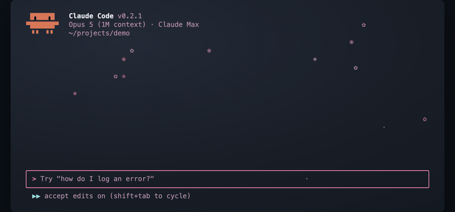
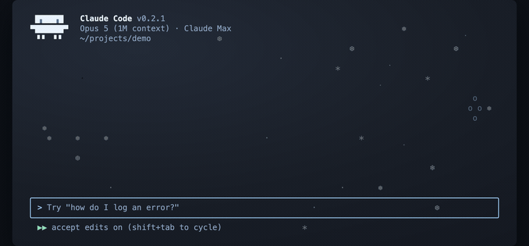

<div align="center">

**A fun Claude Code CLI with animated themes — prompt it, and it builds you your own!**

  

</div>

---

## Install

```sh
npm i -g claude-code-scenes
ccs
```

Then `/theme` to pick one, or `/theme create "a vibe"` to design your own.

## The three starters

Three ship with it. Everything else you prompt for.

#### matrix · rain

Phosphor-green terminal. One hue with discipline.



#### sakura · petals

A cherry-blossom night. Sakura pink leads, honey pays the bills.



#### winter · snowfall

Snow past a lantern-lit yard. Icy blue leads, one warm ember.



## Designing one

Two ways in. If you already know the vibe, say it outright:

```
/theme create "cyberpunk thunderstorm"
```

If you would rather look first, open the picker and take the tile at the top —
that is the flow in the demo above:

```
/theme          →  ✦ Create your own  →  describe it
```

Both land in the same place. One generation, then a loop. You get two views of
the draft — the backdrop animating at full size, and a scripted session
exercising about fifteen colour
slots — and either accepts a change in plain language: *"slower"*, *"add
drifting embers"*, *"calmer warnings"*. Refinements return a delta, so anything
you did not mention stays as it was, and you can undo. Nothing is written to
disk until you keep it.

## Notes

**Animations need the alternate screen buffer**, which is on by default. If you
prefer inline rendering, `/tui off` turns it off permanently — themes still
apply their colours, they just stop moving.

**Theme files are meant to be shared, so nothing in one is ever executed.**
Shader expressions go through a hand-written lexer and parser — no `eval`, no
`Function` constructor, no property access — under hard caps, with a fuzz test.
Details in [docs/features/theme-scenes.md](docs/features/theme-scenes.md).

**Install-time behaviour.** `postinstall` downloads a ripgrep binary from
GitHub releases for the search tools. `CLAUDE_CODE_SKIP_POSTINSTALL=1` skips
it; `RIPGREP_DOWNLOAD_BASE` points it elsewhere. Chrome integration is opt-in
via `CLAUDE_CODE_SETUP_CHROME_MCP=1` and does nothing otherwise.

## Building from source

Needs [Bun](https://bun.sh) ≥ 1.3.11.

```sh
bun install
bun run dev          # run it
bun run precheck     # typecheck + lint + test
bun run capture:scenes   # regenerate the demo assets from the engine
```

## Where your data goes

Short version: to your model provider, and nowhere else. This project runs no
servers, has no account, and collects nothing for itself.

- **Your prompts, code and conversations** go to whichever provider you have
  configured — Anthropic by default, or OpenAI, Gemini, Grok, Bedrock or Vertex
  if you set one up. That traffic is between you and them, under their terms.
  It is not proxied through anything belonging to this project, and no copy is
  kept anywhere.
- **Themes never leave your machine.** They are ordinary JSON files on disk.
  Designing one sends your description — *"winter vibe, snowfall"* — to the
  same provider that answers your prompts, and nothing else.
- **Off until you turn them on:** crash reporting (needs `SENTRY_DSN`), web
  search, and artifact publishing (needs a host you choose). None has a default
  destination.
- **At install time** a ripgrep binary is downloaded from GitHub releases for
  the search tools. That is a download, not an upload;
  `CLAUDE_CODE_SKIP_POSTINSTALL=1` skips it.

One thing inherited from upstream, stated plainly: at startup the feature-flag
client fetches configuration from `api.anthropic.com`, sending a device id,
session id and — if you are signed in — your account identifiers. It goes to
Anthropic, not to us or to a third party, and it carries none of your
conversation.

## What this is, and what it is not

A fork of [claude-code-best/claude-code](https://github.com/claude-code-best/claude-code)
— an independent reverse-engineered reproduction of Claude Code, **not**
Anthropic's official distribution — that adds one thing: **animations that
paint behind your conversation**, and a way to invent new ones by describing
what you want. The animation lives entirely in the theme's JSON file, so no
code ships for it. That is what lets a binary you installed from npm produce an
animation nobody wrote into it.

Not affiliated with, endorsed by, or sponsored by Anthropic. "Claude", "Claude
Code" and "Anthropic" belong to [Anthropic PBC](https://www.anthropic.com/),
and all rights in Claude Code and the Claude models are theirs. If you want the
supported, official tool, use
[Anthropic's Claude Code](https://docs.anthropic.com/en/docs/claude-code).

The animated-theme work is what this fork adds; it is MIT-licensed under
[LICENSE-SCENES](LICENSE-SCENES), scoped by explicit path list. There is
deliberately no repository-wide licence — the reasoning is in
[NOTICE.md](NOTICE.md), which you should read before forking or redistributing.

Provided as-is, with no warranty.
